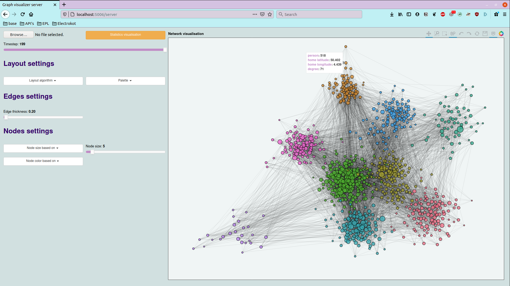
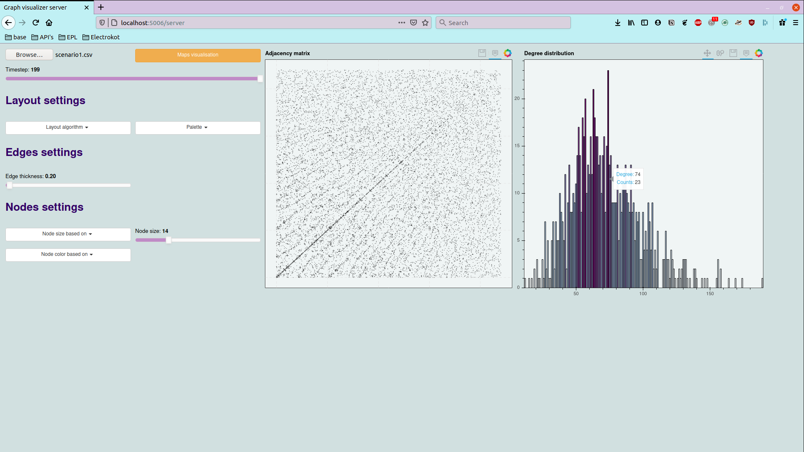
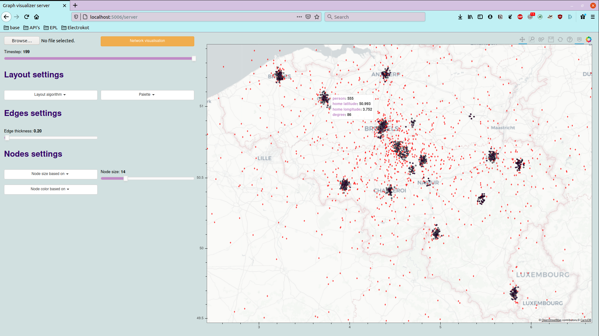

LDATA2010: Data visualisation project
---

The purpose of this application is to create a dashboard for the analysis of contact tracing information in the context of covid-19. It will allow a user to upload its own csv with interactions of people and be able to visualise all interactions within this application.

How to?
---
To launch the server, you just need to execute 
```bash
bokeh serve server
```

Preview
---






